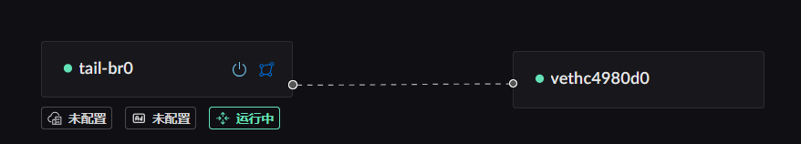
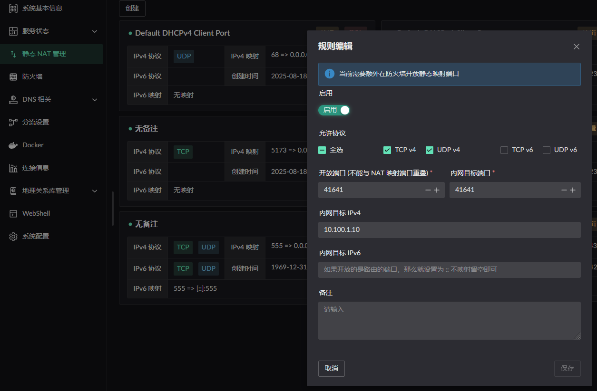
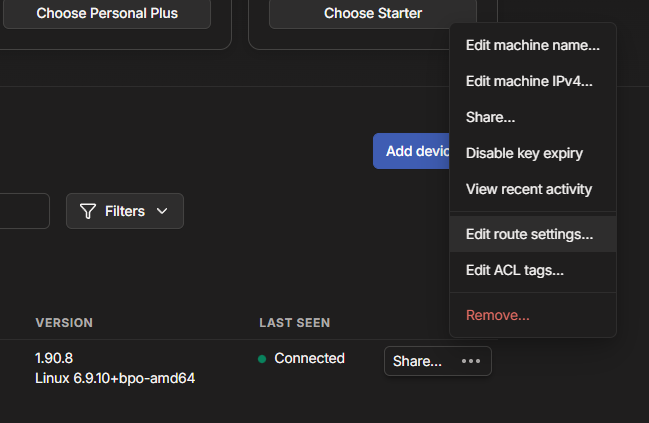
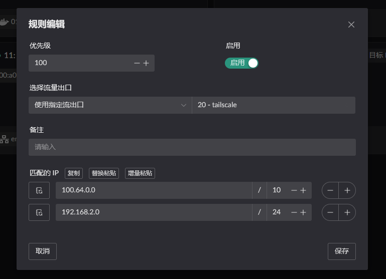
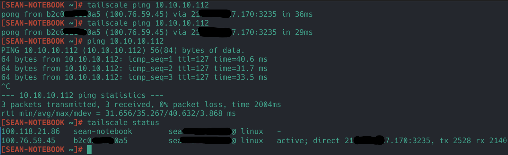
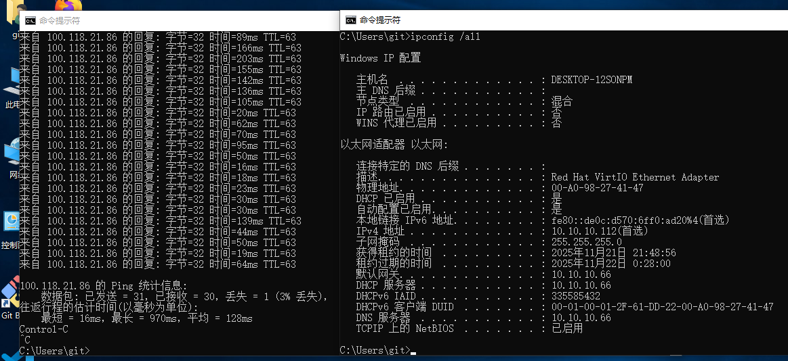

# Tailscale

Deploying Tailscale involves the following steps:

1. Configure **Full Cone NAT**.
2. Start the Tailscale container and create a Flow that uses it as the egress.
3. Configure routing so LAN clients can reach Tailscale addresses and subnets.

## Configuring Full Cone NAT

There are two ways to configure **Full Cone NAT**; use either method.

1. Pin [the port Tailscale uses](https://tailscale.com/kb/1278/tailscaled#flags-to-tailscaled) and open it with a static NAT mapping.
2. Leave the Tailscale port dynamic, add the Tailscale DERP domain or IP to a
   DNS or IP rule, and enable the **Full Cone** switch.

Either method also requires the `Route LAN` service to be enabled on the
bridge to which the container is attached. 

> Static NAT configuration: the internal target port is the container port and
> the target IP is the container IP. 

> Rule configuration  
> This example is not yet tested here; see the ZeroTier page for the same rule
> pattern.

## Starting the container

::: warning
Set a fixed Docker bridge name. If Docker generates a new interface name after
a restart, the LAN service cannot start correctly.

```yaml
networks:
  my-tailscale-bridge:
    driver: bridge
    driver_opts:
      # Keep the bridge name fixed so it remains stable across restarts.
      com.docker.network.bridge.name: tail-br0
```

:::

Start the container from the [image](https://github.com/landscape-router/landscape-apps/pkgs/container/landscape-apps%2Ftailscale) built in the [apps](https://github.com/landscape-router/landscape-apps) repository. The compose file below may be out of date; for the latest, see [docker-compose](https://github.com/landscape-router/landscape-apps/blob/main/tailscale/docker-compose.yaml).

Then start it with your own compose configuration. Note the `--port=41641` argument, which pins the port.

```yaml
services:
  tailscale:
    image: ghcr.io/landscape-router/landscape-apps/tailscale:latest
    container_name: mytail
    restart: unless-stopped
    cap_add:
      - NET_ADMIN
      - SYS_ADMIN
      - PERFMON
    devices:
      - /dev/net/tun
    environment:
      - TS_AUTHKEY=${TS_AUTHKEY}
      - TS_STATE_DIR=/var/lib/tailscale
      - TS_EXTRA_ARGS=${TS_EXTRA_ARGS}
      - TS_USERSPACE=false
      - TS_TAILSCALED_EXTRA_ARGS=--port=41641
    sysctls:
      net.ipv4.ip_forward: '1'
      net.ipv6.conf.all.forwarding: '1'
    volumes:
      - ${DATA_PATH}:/var/lib/tailscale
      - /root/.landscape-router/unix_link/:/ld_unix_link/:ro
    networks:
      my-tailscale-bridge:
        ipv4_address: 10.100.1.10
    dns:
      - 10.100.1.1

networks:
  my-tailscale-bridge:
    driver: bridge
    driver_opts:
      # Keep the bridge name fixed so it remains stable across restarts.
      com.docker.network.bridge.name: tail-br0
    ipam:
      config:
        - subnet: 10.100.1.0/24
          gateway: 10.100.1.1
```

Then create a Flow that uses this container as its egress. 

Approve this node's routes in the Tailscale admin console. 

 Other clients also need the `--accept-routes` option when starting, for example:

```shell
tailscale up --accept-routes
```

## Configuring route rules

Click **Destination IP** on the relevant Flow to configure a rule. Only traffic
matching that rule uses the Flow. 

In this example, the LAN client with MAC address `00:a0:98:27:41:47` is
governed by `Flow 11`. Configure **Destination IP** on `Flow 11` and select
`Flow 20`, the Flow created for the container, as the egress. 

Traffic to `100.64.0.0/10` or `192.168.2.0/24` then uses the `Flow 20`
(Tailscale) egress and is forwarded into the `mytail` container.

> The `192.168.2.0/24` example assumes Tailscale is also deployed on the far
> side. In that case, configure the remote subnet directly to enable two-way
> access.

## Verifying the result

1. From a Tailscale client **not** deployed on the router (`100.118.21.86`),
   ping the client at `00:a0:98:27:41:47`. The request is handled by
   `100.76.59.45` in the container. 
2. From the client at `00:a0:98:27:41:47`, ping the Tailscale client not
   deployed on the router (`100.118.21.86`). 
