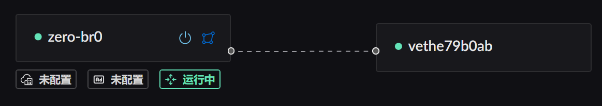
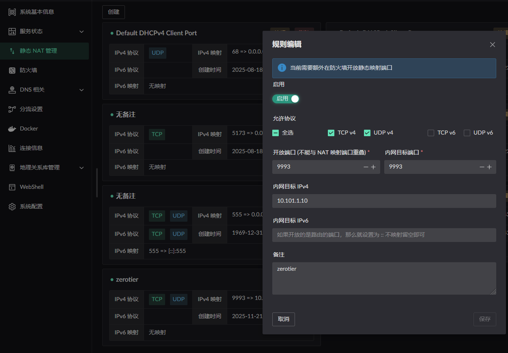
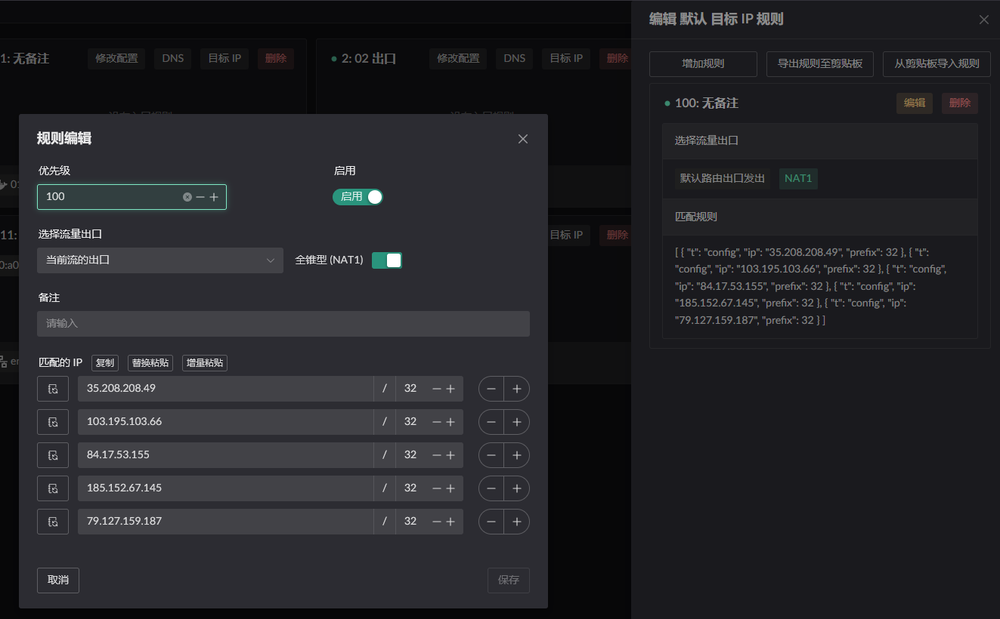
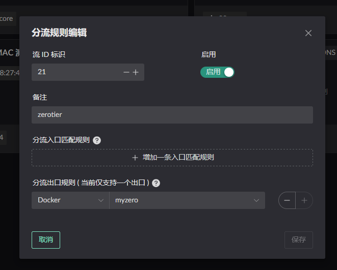
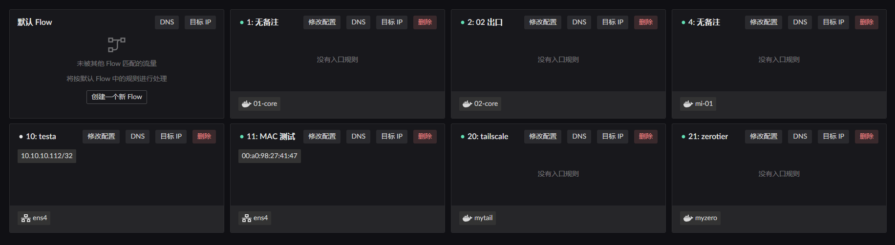
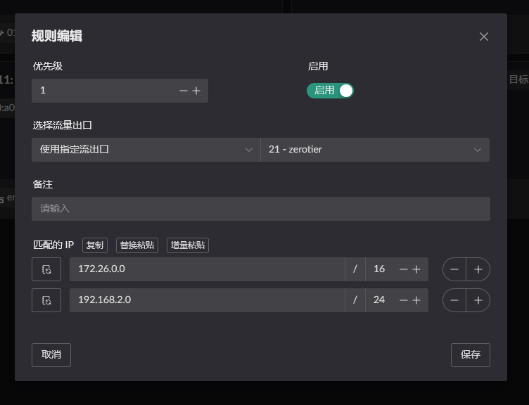
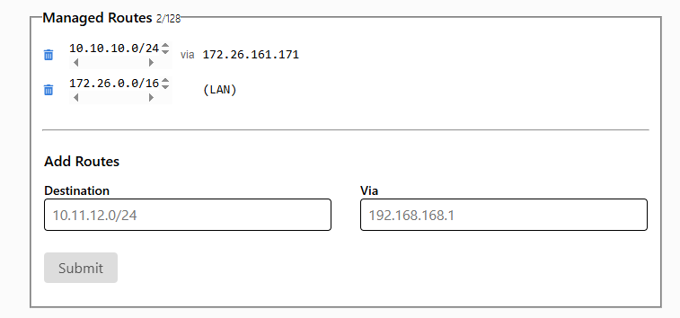
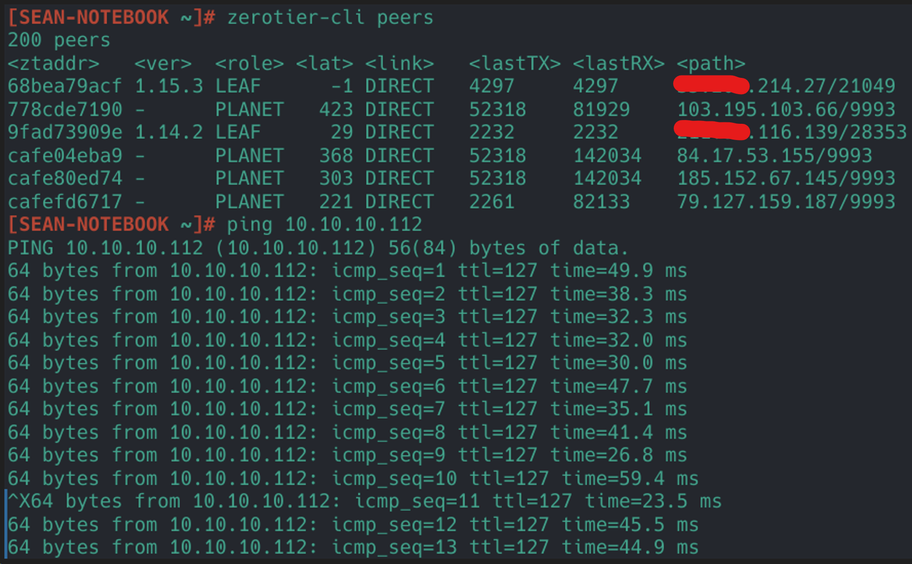
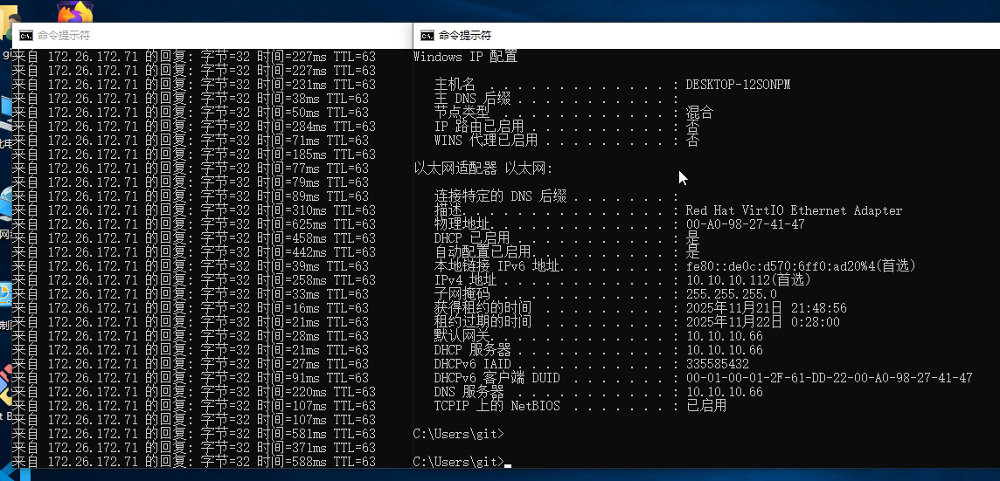

# ZeroTier

Deploying ZeroTier roughly comes down to:

1. Set up NAT1 mapping
2. Start the ZeroTier container and create a Flow that uses it as the egress
3. Set up routing so programs on the LAN can reach the IPs / subnets inside ZeroTier

## Setting up NAT1

There are two ways to get FullCone NAT (NAT1); either one works.

1. Configure a static NAT mapping for the port ZeroTier uses (`9993`).
2. Add the `PLANET` addresses ZeroTier uses to an IP rule and turn the NAT1 switch on.

Both only take effect once the `Route LAN` service is enabled on the `bridge` the container belongs to, as shown below. 

> Static NAT configuration (the internal target port is the container port, the IP is the container IP) 

> IP rule configuration (note this goes in the `destination IP rules` of the `default flow`, assuming you have not made the container's MAC or IP the ingress of some other flow)  You can copy the JSON below and paste it into the rule
>
> ```json
> [
>   {
>     "t": "config",
>     "ip": "35.208.208.49",
>     "prefix": 32
>   },
>   {
>     "t": "config",
>     "ip": "103.195.103.66",
>     "prefix": 32
>   },
>   {
>     "t": "config",
>     "ip": "84.17.53.155",
>     "prefix": 32
>   },
>   {
>     "t": "config",
>     "ip": "185.152.67.145",
>     "prefix": 32
>   },
>   {
>     "t": "config",
>     "ip": "79.127.159.187",
>     "prefix": 32
>   }
> ]
> ```

## Starting the container

::: warning
You must set the bridge name!

```yaml
networks:
  my-zerotier-bridge:
    driver: bridge
    driver_opts:
      # Must be set. Otherwise a dynamic interface name is used, and a restart changes it,
      # which stops the LAN service from starting properly.
      com.docker.network.bridge.name: zero-br0
```

:::

Start the container from the [image](https://github.com/landscape-router/landscape-apps/pkgs/container/landscape-apps%2Fzerotier) built in the [apps](https://github.com/landscape-router/landscape-apps) repository. The compose file below may be out of date; for the latest, see [docker-compose](https://github.com/landscape-router/landscape-apps/blob/main/zerotier/docker-compose.yaml).

Then start it with your own compose configuration.

```yaml
services:
  zerotier:
    image: ghcr.io/landscape-router/landscape-apps/zerotier:latest
    container_name: myzero
    restart: unless-stopped
    cap_add:
      - NET_ADMIN
      - SYS_ADMIN
      - BPF
      - PERFMON
    devices:
      - /dev/net/tun
    command: ${NETWORK_ID}
    sysctls:
      net.ipv4.ip_forward: '1'
      net.ipv6.conf.all.forwarding: '1'
    volumes:
      - ${DATA_PATH}:/var/lib/zerotier-one
      - /root/.landscape-router/unix_link/:/ld_unix_link/:ro
    networks:
      my-zerotier-bridge:
        ipv4_address: 10.101.1.10
    dns:
      - 10.101.1.1

networks:
  my-zerotier-bridge:
    driver: bridge
    driver_opts:
      # Must be set. Otherwise a dynamic interface name is used, and a restart changes it,
      # which stops the LAN service from starting properly.
      com.docker.network.bridge.name: zero-br0
    ipam:
      config:
        - subnet: 10.101.1.0/24
          gateway: 10.101.1.1
```

Once the container is up you should see:

```
docker exec <container name> zerotier-cli peers
200 peers
<ztaddr>   <ver>  <role> <lat> <link>   <lastTX> <lastRX> <path>
68bea79acf 1.15.3 LEAF     274 DIRECT   13477    13477    xxx.xxx.xxx.xxx/21049
778cde7190 -      PLANET   329 DIRECT   25175    29846    103.195.103.66/9993
cafe04eba9 -      PLANET   290 DIRECT   25175    29885    84.17.53.155/9993
cafe80ed74 -      PLANET   192 DIRECT   25175    29795    185.152.67.145/9993
cafefd6717 -      PLANET   137 DIRECT   172      25038    79.127.159.187/9993
```

Then create a Flow that uses this container as its egress. 

## Configuring the "route" rules

Click the `Destination IP` button on the relevant Flow to configure it. Only Flows with a matching rule take effect. 

For instance, my LAN client's MAC address is `00:a0:98:27:41:47` and that client is currently governed by the `Flow 11` rules. So I configure `Destination IP` on `Flow 11` and pick the egress as `Flow 21`, the one created when starting the container. 

Beyond that, remember to check:

```text
docker exec <container name> ip add
...
3: zt6jy55lqy: <BROADCAST,MULTICAST,UP,LOWER_UP> mtu 2800 qdisc fq_codel state UNKNOWN group default qlen 1000
    link/ether d6:46:9c:3c:ed:45 brd ff:ff:ff:ff:ff:ff
    inet 172.26.161.171/16 brd 172.26.255.255 scope global zt6jy55lqy
       valid_lft forever preferred_lft forever
    inet6 fe80::d446:9cff:fe3c:ed45/64 scope link
       valid_lft forever preferred_lft forever
```

Add your internal subnet (mine is `10.10.10.0/24`) to ZeroTier, with the `via` field set to the container's IP you just looked up `(172.26.161.171)`. 

Connect from another client now and you will be able to reach resources on your LAN.

## Verifying the result

The devices involved:

- `Device 1`: 172.26.172.71, a `ZeroTier client` **not** deployed on the router
- `Device 2`: 172.26.161.171, the `ZeroTier client` deployed on the router
- `Device 3`: 10.10.10.112, a host on the router's LAN

1. Ping `Device 3` from `Device 1`, handled through `Device 2`. 
2. Ping `Device 1` from `Device 3`, handled through `Device 2`. 

## Appendix: the PLANET addresses ZeroTier uses

The IPs to put in the IP rule are whatever these domains resolve to:

```text
root-mia-01.zerotier.com
root-tok-01.zerotier.com
root-zrh-01.zerotier.com
root-lax-01.zerotier.com
```
