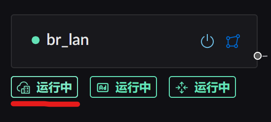
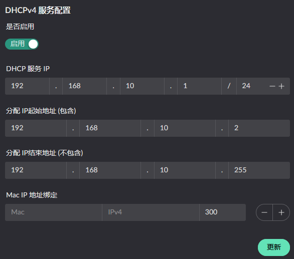

# DHCP v4 相关

## 服务配置

DHCP 服务的开启需要先将网卡的区域配置成 Lan, 然后找到如下服务按钮:



点击配置服务按钮后将呈现:



按需进行配置服务即可

## 内网 IP 分配情况

可在侧边栏: "服务状态" -> "DHCPv4 服务" 查看, 当前页面上可以看到 IP 的配置情况, 并且 DHCP 服务会每隔 1小时 进行一次 ARP 扫描. 扫描的范围是当前配置的 IP 网段.


> 其中 **橙黄色** 的条目是非本次启动分配的IP, 可能是  
> 1.上次分配但是还未重新进行 DHCP 请求的主机, 重新请求后就会正常展示  
> 2. 静态配置的 IP

## 服务端自动下发的 option

这几个 option 由服务端自己管理, **不能被自定义 option 覆盖, 也不能被过滤掉** (过滤会破坏 DHCP
本身的功能):

| Code | 名称               | 内容                   |
| ---- | ------------------ | ---------------------- |
| 1    | Subnet Mask        | 由 `network_mask` 换算 |
| 3    | Router             | `server_ip_addr`       |
| 6    | Domain Name Server | `server_ip_addr`       |
| 51   | Address Lease Time | `address_lease_time`   |
| 53   | Message Type       | DHCP 协议本身          |
| 54   | Server Identifier  | `server_ip_addr`       |

另外 `0` (Pad) 与 `255` (End) 是协议保留, 同样不可使用.

## 自定义 option

除上表之外, 还可以下发一组**白名单内**的 option. 可以配在两个层级:

- **全局**: DHCP 服务配置的 `custom_options`, 对所有客户端生效
- **按设备**: 已录入设备的 `dhcp_custom_options`, 覆盖同 code 的全局配置

支持的 option:

| Code | 变体名                  | 类型           | 用途                          |
| ---- | ----------------------- | -------------- | ----------------------------- |
| 66   | `TFTPServerName`        | 字符串         | TFTP 服务器名 (iPXE 网络引导) |
| 67   | `BootfileName`          | 字符串         | 引导文件名 (iPXE 网络引导)    |
| 43   | `VendorExtensions`      | 十六进制字符串 | 厂商自定义扩展                |
| 82   | `RelayAgentInformation` | 结构化子选项   | DHCP 中继代理信息             |
| 162  | `Dnr`                   | 结构化, 见下   | 加密 DNS 发现 (RFC 9463)      |

JSON 形态是 serde 外部标签, 即 `{"变体名": 值}`:

```json
[
  { "TFTPServerName": "192.168.1.1" },
  { "BootfileName": "ipxe.kpxe" },
  { "VendorExtensions": "ff0001" },
  { "RelayAgentInformation": { "AgentCircuitId": "010203" } }
]
```

::: warning

- 同一个 code **不能重复出现**, 否则配置校验失败
- 单个 option 的数据部分**最长 255 字节**. 超长不会被拆成多条, 而是直接报错
- 自定义 option 是**无条件注入**所有响应的, 不像 option 15/119 那样要客户端在 option 55 里点名
- 按设备的 `dhcp_custom_options` / `dhcp_filter_options` 改完**需要重启 DHCP 服务**才生效
  :::

### option 过滤

已录入设备还可以用 `dhcp_filter_options` 填一组 code, 表示**不要**给这台设备下发这些 option.
上面「服务端自动下发」表里的 6 个 code 与协议保留的 `0`/`255` 不允许填进来.

### DNR (option 162)

用来告诉客户端「加密 DNS (DoH) 在哪」, 支持两种模式:

::: code-group

```json [local: 用路由器自己的 DoH]
[{ "Dnr": { "mode": "local" } }]
```

```json [custom: 手工指定]
[
  {
    "Dnr": {
      "mode": "custom",
      "domains": ["dns.example.com"],
      "ips": ["192.168.5.1"],
      "port": 6053,
      "doh_path": "/dns-query"
    }
  }
]
```

:::

`local` 模式下各项取值:

| 项          | 取自                                                        |
| ----------- | ----------------------------------------------------------- |
| 域名        | **API TLS 证书**里的域名 (证书管理里打开「用于 API」的那些) |
| IP          | DHCP 的 `server_ip_addr`                                    |
| 端口 / 路径 | `[dns]` 的 `doh_listen_port` / `doh_http_endpoint`          |

`custom` 模式下留空的字段会回落到 `local` 的对应取值.

::: warning DNR 可能被静默跳过
DoH 要求客户端能校验证书, 所以这个 option 必须带域名. 当**域名列表为空** (例如没有任何
`for_api` 证书) 或**可用 IP 为空**时, 该 option 会被**直接跳过**, 其余响应照常返回 ——
不会报错. 配了 DNR 但抓包看不到 option 162 时, 先检查证书域名.
:::
