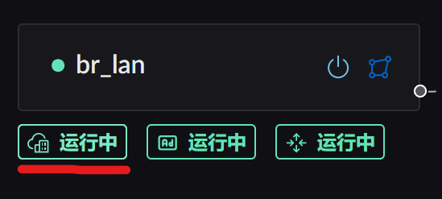
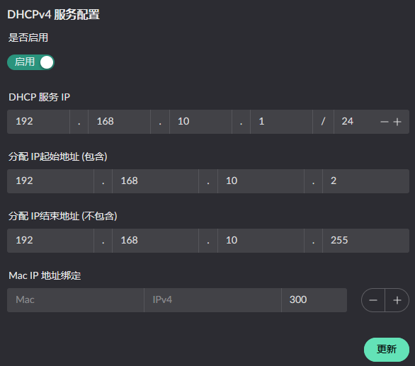
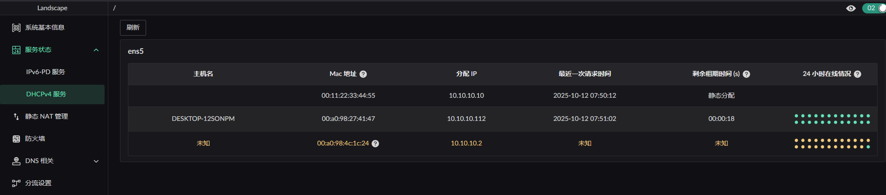

# DHCPv4 Server

## Service configuration

To enable the DHCP service, first set the interface's zone to Lan, then find the service button below:



Clicking the configure button shows:



Configure the service as needed.

## Assigned addresses on the LAN

You can review these in the sidebar under "Service Status" -> "DHCPv4 Service". The page shows how addresses are currently allocated, and the DHCP service runs an ARP scan once an hour across the configured subnet.



> Entries in **orange** were not assigned during this run. They may be
>
> 1. hosts that were assigned an address previously but have not made a new DHCP request yet — they will display normally once they do
> 2. statically configured addresses

## Options the server sends automatically

These options are managed by the server itself. They **cannot be overridden by custom options, nor filtered out** (filtering them would break DHCP itself):

| Code | Name               | Value                       |
| ---- | ------------------ | --------------------------- |
| 1    | Subnet Mask        | derived from `network_mask` |
| 3    | Router             | `server_ip_addr`            |
| 6    | Domain Name Server | `server_ip_addr`            |
| 51   | Address Lease Time | `address_lease_time`        |
| 53   | Message Type       | part of the DHCP protocol   |
| 54   | Server Identifier  | `server_ip_addr`            |

In addition, `0` (Pad) and `255` (End) are reserved by the protocol and likewise unavailable.

## Custom options

Beyond the table above, you can send a set of options from a **whitelist**. They can be set at two levels:

- **Global**: `custom_options` on the DHCP service configuration, applied to every client
- **Per device**: `dhcp_custom_options` on an enrolled device, overriding the global entry with the same code

Supported options:

| Code | Variant                 | Type              | Purpose                              |
| ---- | ----------------------- | ----------------- | ------------------------------------ |
| 66   | `TFTPServerName`        | string            | TFTP server name (iPXE network boot) |
| 67   | `BootfileName`          | string            | Boot file name (iPXE network boot)   |
| 43   | `VendorExtensions`      | hex string        | Vendor-specific extensions           |
| 82   | `RelayAgentInformation` | structured        | DHCP relay agent information         |
| 162  | `Dnr`                   | structured, below | Encrypted DNS discovery (RFC 9463)   |

The JSON form is serde's external tagging, i.e. `{"Variant": value}`:

```json
[
  { "TFTPServerName": "192.168.1.1" },
  { "BootfileName": "ipxe.kpxe" },
  { "VendorExtensions": "ff0001" },
  { "RelayAgentInformation": { "AgentCircuitId": "010203" } }
]
```

::: warning

- The same code **must not appear twice**, or config validation fails
- The data part of a single option is **at most 255 bytes**. Oversized data is not split into repeated options — it is rejected outright
- Custom options are **injected unconditionally** into every response, unlike options 15/119 which the client has to ask for in option 55
- Changes to a device's `dhcp_custom_options` / `dhcp_filter_options` **require restarting the DHCP service** to take effect
  :::

### Filtering options

An enrolled device can also carry `dhcp_filter_options`, a list of codes that should **not** be sent to that device. The six codes in the "sent automatically" table above, along with the protocol-reserved `0` and `255`, are not allowed here.

### DNR (option 162)

Tells clients where encrypted DNS (DoH) lives. Two modes are supported:

::: code-group

```json [local: use the router's own DoH]
[{ "Dnr": { "mode": "local" } }]
```

```json [custom: specify it yourself]
[
  {
    "Dnr": {
      "mode": "custom",
      "domains": ["dns.example.com"],
      "ips": ["192.168.5.1"],
      "port": 6053,
      "doh_path": "/dns-query"
    }
  }
]
```

:::

Where each value comes from in `local` mode:

| Item        | Source                                                                        |
| ----------- | ----------------------------------------------------------------------------- |
| Domains     | the domains on the **API TLS certificate** (those with "use for API" enabled) |
| IP          | the DHCP `server_ip_addr`                                                     |
| Port / path | `doh_listen_port` / `doh_http_endpoint` under `[dns]`                         |

In `custom` mode, any field left empty falls back to the `local` value.

::: warning DNR can be skipped silently
DoH requires the client to validate a certificate, so this option must carry a domain. When the **domain list is empty** (for example, when there is no `for_api` certificate at all) or **no usable IP** remains, the option is **skipped entirely** while the rest of the response is returned as usual — no error is raised. If you configured DNR but cannot see option 162 in a packet capture, check the certificate domains first.
:::
