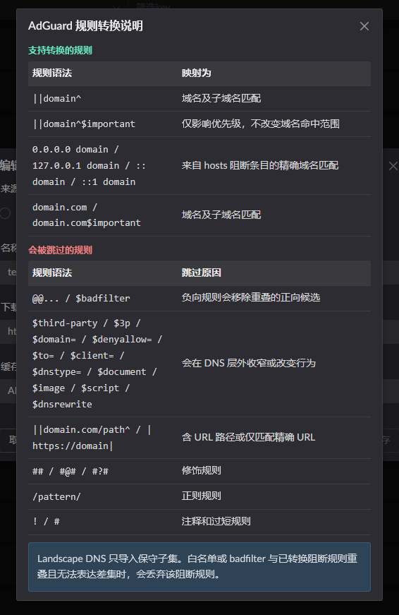

# Geo Database Management

## Supported sources

1. Periodic daily updates from a URL
2. Manual entry
3. AdGuard rule conversion

## Adding a configuration

1. Click `Geo IP config`
2. Click `Add rule` in the dialog on the right

 

## Fetching from a URL

## Updating by uploading a file

## Forcing an update

## Using a TXT file

## Converting AdGuard rules

