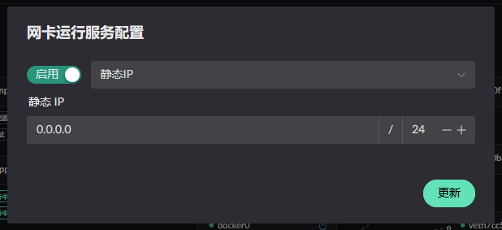
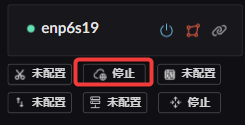
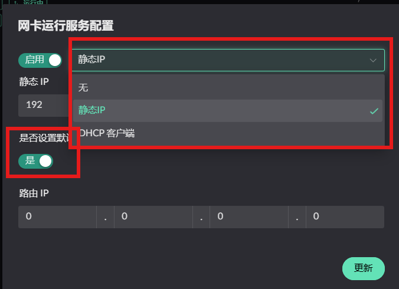
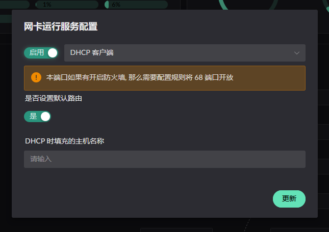
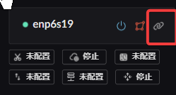
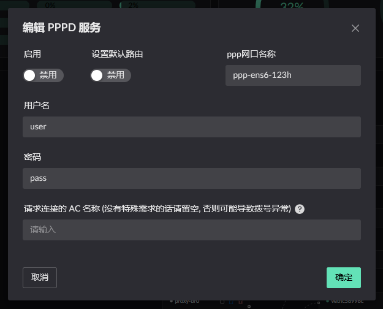
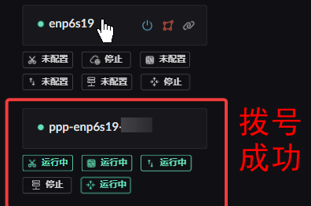

# Interface IP Settings

## Static IP

::: info
A static IP can be configured while the interface is in the Undefined or WAN zone.
:::

When the interface is in the WAN zone, you can additionally mark it as the **default route** for **_IPv4_**.

  

## DHCP client

::: info
Only available while the interface is in the WAN zone.

The hostname is optional — the machine's own hostname is used by default.
:::

## PPPoE

::: info
Only available while the interface is in the WAN zone.

PPPoE needs an existing interface to communicate over, so it has to be set up on an interface that is already in the WAN zone.
:::

1. Add a PPPoE account on the WAN interface
2. Mark the PPPoE account as the default route
3. Only fill in AC Name if you actually need it; leave it empty otherwise

  
  
  

