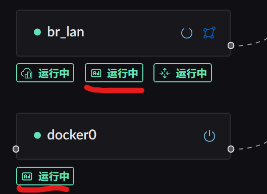
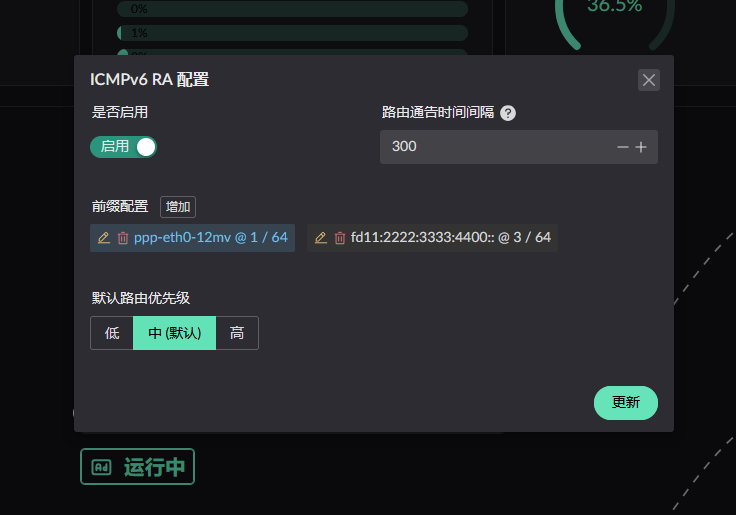
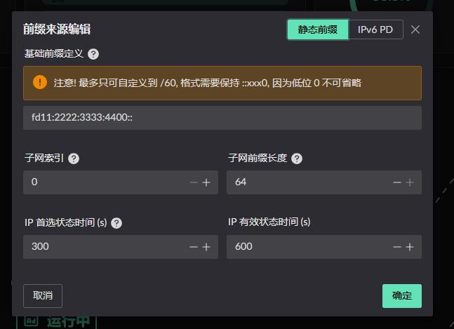
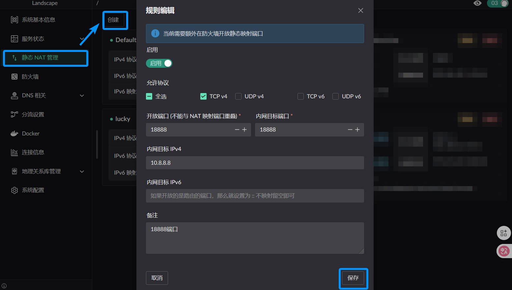

# IPv6 Configuration

For delegated-prefix features, your ISP must support prefix delegation and
provide a `/60` or larger address block (a prefix length of `/60` or shorter).
Static IPv6 RA configuration is also available without a delegated prefix.

## IPv6 PD

Start by obtaining the prefix. You request it on the corresponding interface by enabling the PD service on your WAN interface. Find the service button first, as shown below: 

After opening the service, select **Update**. Change the MAC address only when
your ISP requires it. 

After the prefix is obtained, review it in the sidebar under **Service Status
-> IPv6-PD Service**. 

## IPv6 RA

The advertised addresses can be private ones you choose yourself — obtaining an IPv6 prefix is not a requirement. Find the advertisement service button first. Note that this service only appears on interfaces in the LAN zone:

Click the service button to open its configuration panel. 

> **Advertisement interval** is how often the server **proactively** and **periodically** multicasts to the LAN.

An advertised prefix comes from one of two sources: static, or obtained dynamically via PD. Click add next to the prefix configuration to open the dialog.

### Adding a static prefix

Add the static prefix and configure it for your network. 

### Adding a PD-obtained prefix

Select the interface running the PD service. The target interface does not need
to have obtained a prefix yet, but the PD service must be enabled. 

::: warning
The `subnet index` must be **>= 1** — **index 0 is reserved for WAN**, and using 0 is rejected (`RA pool_index must be >= 1`).

Within one interface's RA configuration, different prefixes must not reuse a
`subnet index`.

Across different interfaces, a prefix must not reuse the same `subnet index`
either.

For example, say you have interfaces A and B, dynamic prefixes PD1 and PD2, and a static prefix S1.

If S1 on interface A uses `subnet index 1` and PD1 uses `subnet index 2`,
interface A cannot add another prefix at index 1 or 2. On interface B, PD1 can
use any index except 2, and PD2 can use any index.
:::

There is also a constraint on the parent prefix length: a static parent prefix only accepts **/56 to /63**, and the parent prefix must be shorter than /64.

Once configured, click update. Note that prefix edits do not take effect until you click the update button.

## IPv6 NPT

For both statically configured and PD-obtained prefixes, Landscape checks the
prefix on egress against the prefix obtained by the **outgoing interface's** PD
service. If they differ, Landscape rewrites the packet to use the outgoing
interface's prefix.

## IPv6 static mapping (available in v0.8.1 and later)

::: warning
For now you also need to open the mapped ports in the [firewall](../firewall.md).
:::

Open **Static NAT Management** from the right-hand menu and click **Create**.

There are three cases for how IPv6 is allocated:

1. A `static` IPv6 prefix is assigned on the LAN
2. Only a `dynamic` PD prefix is assigned on the LAN
3. Both dynamic and static prefixes are assigned on the LAN

For case 1, enter the complete IPv6 address as the internal target. With two
WAN interfaces using different PD prefixes, both prefixes can then be mapped
to the same internal host.

For cases 2 and 3, enter only the lower 64 bits of the target address, which
SLAAC generates automatically. The host is then reachable only through the PD
prefix already assigned to it, not through prefixes obtained by other WAN
interfaces.
