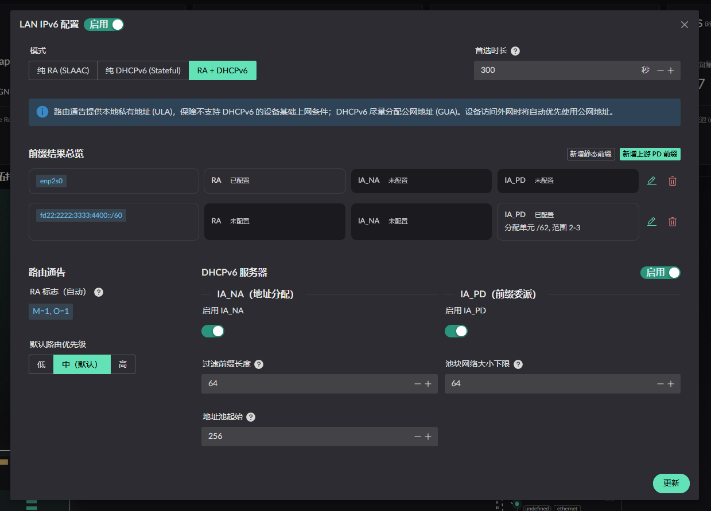
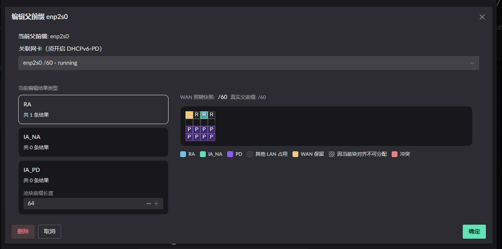

# LAN IPv6 Allocation

There are three ways to allocate IPv6 addresses on a LAN:

1. SLAAC (RA mode)
2. DHCPv6
3. Hybrid (RA + DHCPv6)

## IPv6 prefix allocation canvas

The **expected upstream PD prefix length** mentioned in the WAN PD settings
limits the size of this canvas.

For example, an upstream prefix of **/60** provides **16** **/64 blocks** for
downstream networks.

Select the required **type** on the left and then choose a **block** on the
right.

If you do not need to delegate prefixes downstream, the PD section can be left
unconfigured.
