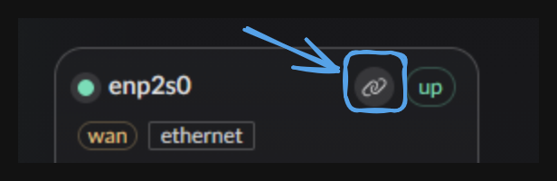
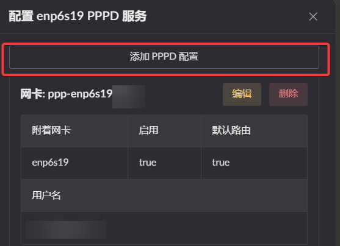
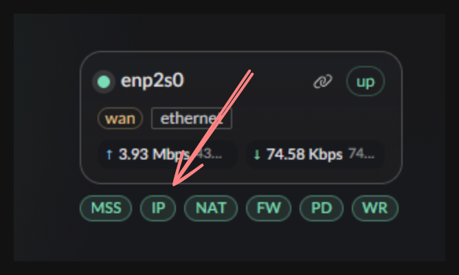
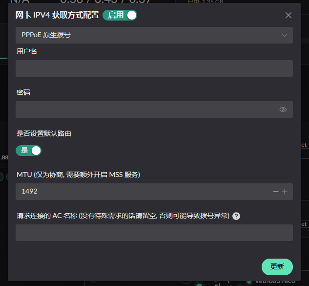

# PPPoE

Landscape supports two ways to establish a PPPoE connection:

1. Use `pppd` (requires installing `pppd` separately)
2. Use the native PPPoE implementation

## Using `pppd`

::: info
This icon is available only when the interface is in the WAN zone.
:::

Clicking it opens the list of `pppd` configurations.

Click **Add pppd configuration** at the top of the list to open the editor.

## Native PPPoE

::: info
This method dials directly on the WAN interface and has slightly lower
compatibility.
:::

Click the IP button on the WAN interface.

Select **Native PPPoE** from the dropdown.

