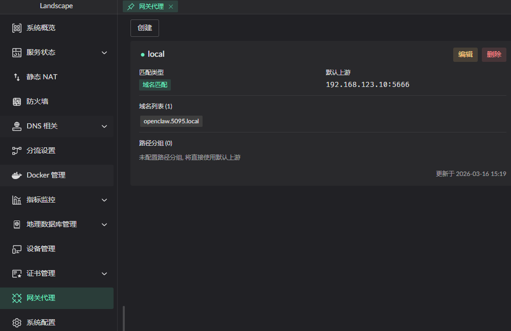

# HTTP Reverse Proxy

::: warning
Available in v0.17.3 and later; the feature is still being refined.
:::

## Proxy configuration

1. Combine the proxy with a certificate from Certificate Management to serve
   HTTPS. Enable **use for gateway** on the matching domain.
2. Path-based routing is supported.
3. TLS connections to the backend are supported. 

4. The gateway proxy can be enabled or disabled, and its listening ports can
   be managed. 
