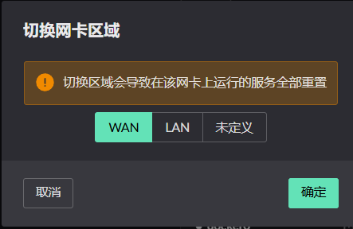
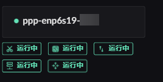
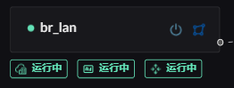

# Interface Zones

In Landscape Router, each zone provides a different set of services. Assign an
interface to the appropriate zone before configuring it.

## Where the switch button is

## Services available on WAN

The default services are a suitable starting point for most configurations.

- TCP MSS clamping
- Firewall service
- Interface NAT
- IPv6-PD client
- WAN route forwarding

## Services available on LAN

Enable the services required by your LAN:

- DHCPv4 server, including MAC-to-IP binding
- ICMPv6 RA service
- LAN route forwarding

