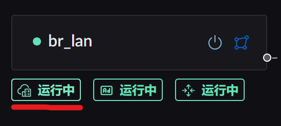
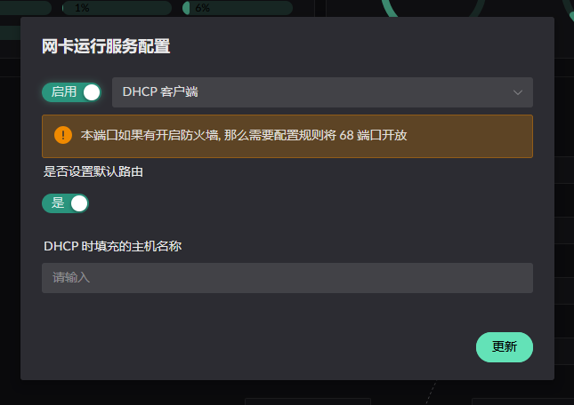
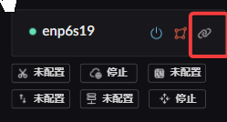
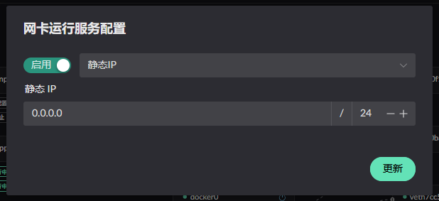
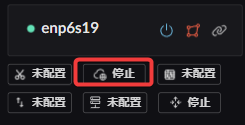

# 基础的网络配置

> 本文引导你完成 Landscape Router 的基础网络配置：为网卡分配区域、设置 IP 地址、启用防火墙，让你的路由器可以正常上网。

## 第一步：了解区域 (Zone)

::: tip 简单理解
**WAN** = 接光猫/外网的网口，**LAN** = 接电脑/交换机的网口。

详细说明参考：[区域 (Zone)](../network/interface-zone)
:::

进入页面 **系统基本设置**，在拓扑视图中将网卡拖拽到对应区域：

## 第二步：配置 WAN 口上网

WAN 口需要配置 IP 才能连上互联网，有三种方式，根据你的网络环境选择一种。

::: tabs
== DHCP 自动获取

适合光猫拨号、上级路由器已开启 DHCP 的场景。

1. 确保网卡已分配为 **WAN** 区域
2. 进入页面 **IPv4 相关**，点击 **DHCP 客户端** 标签
3. 填写主机名称（可选，留空则使用当前主机名）
4. 点击保存

== PPPoE 拨号

适合光猫桥接模式，需要用宽带账号密码拨号。

1. 确保网卡已分配为 **WAN** 区域
2. 进入页面 **IPv4 相关**，点击 **PPPoE** 标签
3. 在 WAN 网卡上添加 PPPoE 账号
4. 填入宽带账号和密码
5. 在 PPPoE 账号中开启 **设为默认路由**
6. AC Name 通常留空即可

== 静态 IP

适合企业专线、需要固定 IP 的场景。

1. 确保网卡已分配为 **WAN** 区域
2. 进入页面 **IPv4 相关**，点击 **静态 IP** 标签
3. 填入 IP 地址、子网掩码、网关
4. 如需作为默认路由，勾选 **IPv4 默认路由**
5. 点击保存

:::

## 第三步：配置 LAN 口

LAN 口连接内网设备，通常设置为静态 IP。

1. 确保网卡已分配为 **LAN** 区域
2. 进入页面 **IPv4 相关**，点击 **静态 IP** 标签
3. 为 LAN 口填写内网地址（例如 `192.168.1.1`）
4. 子网掩码填 `255.255.255.0`（或 `/24`）
5. 点击保存

::: tip
如果需要 LAN 下的设备自动获取 IP

## 第四步：防火墙设置

Landscape Router 自 0.16.0 起采用**黑名单模式**，默认放行所有流量。

1. 进入页面 **防火墙设置**
2. 如需阻止特定来源/目标，添加黑名单规则

::: warning
如果你的路由器直接暴露在公网

## 第五步：验证网络连通性

配置完成后，检查网络是否正常工作：

1. 打开 **指标监控 → 连接信息** 查看当前连接状态
2. 在内网设备上执行 `ping 8.8.8.8` 测试外网连通
3. 执行 `nslookup baidu.com` 测试 DNS 解析

::: tip 下一步
基础网络配置完成后，建议继续配置 [DNS 配置](./dns-setup) 和 [分流配置](./flow-setup)。
:::
