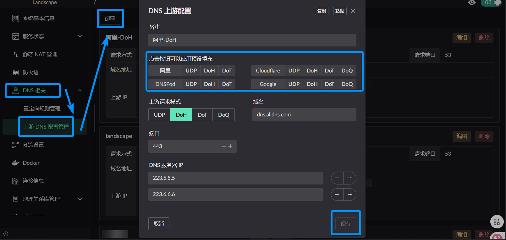
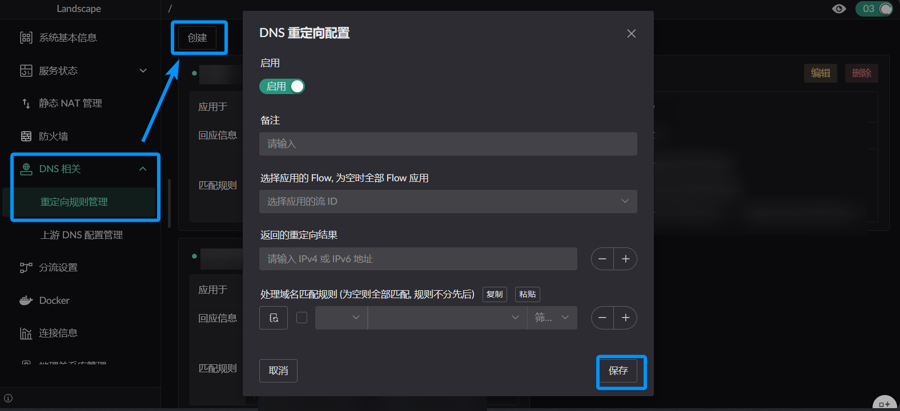

# DNS 配置

> 本文引导你完成 DNS 相关配置：设置上游 DNS 服务器、创建重定向规则，确保内网设备可以正常解析域名。

## 第一步：配置上游 DNS 服务器

上游 DNS 是 Landscape Router 用来解析域名的外部 DNS 服务。

1. 进入页面 **DNS 相关**
2. 找到 **上游 DNS 配置管理** 区域
3. 点击添加，填入上游 DNS 地址
   - 常用公共 DNS：`119.29.29.29`（腾讯）、`223.5.5.5`（阿里）、`8.8.8.8`（Google）
4. 可添加多个上游 DNS 实现冗余



## 第二步：配置 DNS 重定向规则（可选）

DNS 重定向可以将特定域名的 DNS 查询转发到指定的上游服务器。

::: info 使用场景
例如：将 `*.google.com` 的 DNS 查询转发到特定 DNS 服务器，配合分流实现精细控制。
:::

1. 进入页面 **DNS 相关**
2. 找到 **重定向规则管理** 区域
3. 点击添加，配置以下内容：
   - **应用的 Flow**：选择生效的分流（留空则对所有 Flow 生效）
   - **返回的重定向结果**：指定目标 DNS 服务器
   - **处理域名匹配规则**：添加需要被重定向的域名



## 第三步：验证 DNS 解析

1. 在内网设备上执行：

```bash
# 测试基础解析
nslookup baidu.com

# 测试使用路由器作为 DNS 服务器
nslookup baidu.com 192.168.1.1
```

2. 如果解析失败，检查：
   - 上游 DNS 服务器地址是否正确
   - 内网设备的 DNS 是否指向路由器的 LAN 口地址
   - DHCP Server 是否正确下发了 DNS 地址

## 相关阅读

- [DNS 服务常见问题](../faq/dns)
- [DHCPv4 Server 相关](../network/dhcpv4)
- [分流配置](./flow-setup)
