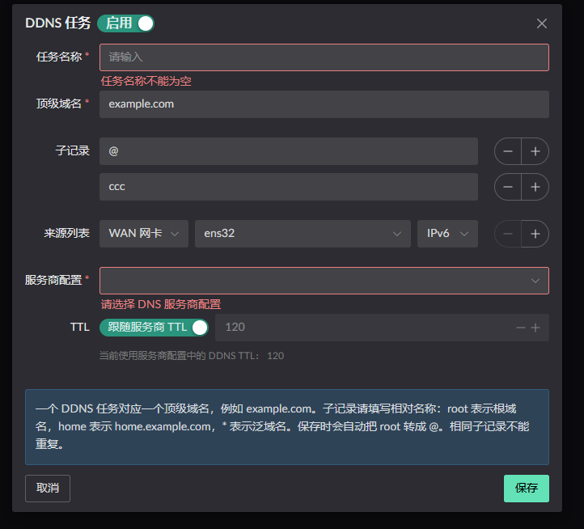
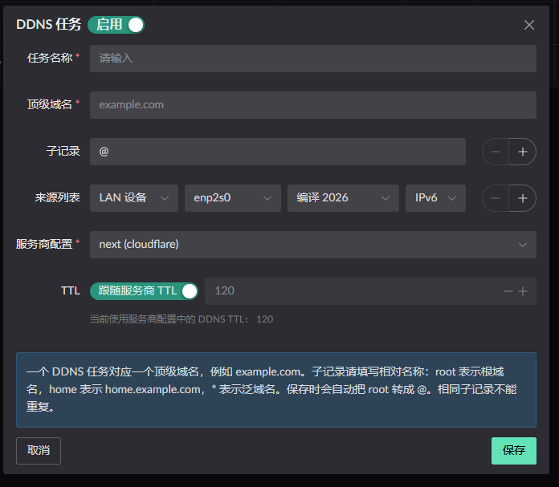

# DDNS

可将 WAN 网卡或者 内网设备 获得的动态公网IPv4/6, 更新到指定运营商的 DNS 记录中

## 将 WAN 网卡 IP 进行 DDNS

如下示意图, 将会把 WAN 获得的 IPv6 更新到 **example.com** 和 **ccc.example.com**.

## 将 LAN 设备进行 DDNS

LAN 设备也是一样的, 多出来的选择框是, 选择这个设备将使用哪个 PD 前缀进行设置 DNS 记录.

比如, 你有两个 WAN , **WAN1** 获得了 **PD A**, **WAN2** 获得了 **PD B**.

当你制定了 **WAN1** 作为这个 LAN 设备的 DDNS 前缀配置, 那么在 DNS 记录中最终的效果是.
**PD A** + 设备获得的后缀.

