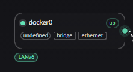

# 给 Docker 容器分配 IPv6

## 修改 Docker 配置

首先需要修改 docker 配置文件开启 IPv6. 文件位置 **/etc/docker/daemon.json**

```json
{
  "ipv6": true,
  "fixed-cidr-v6": "fd00::/80"
}
```

点击 docker 网卡上的 IPv6 配置即可进行分配.


## compose 配置文件

如果是 compose 文件就使用如下的方式进行定义, 需要的注意点有三个:

1. 设置 **com.docker.network.bridge.name**
2. 网卡出现时要将区域转为 LAN, 然后再开启 LANv6 服务
3. 设置一个 IPv6 配置, 否则即使我们开启了 v6 分配服务, 容器还是无法获得 IP 的.
   假设容器内没有额外部署 DHCPv6 客户端的情况下, 一般是只能通过 RA 获得地址的.

```yaml
networks:
  example_network:
    name: example-network
    driver: bridge
    enable_ipv6: true
    driver_opts:
      # 宿主机实际网桥名，最多 15 个字符
      com.docker.network.bridge.name: br-example-v6
    ipam:
      driver: default
      config:
        - subnet: 172.30.0.0/24
          gateway: 172.30.0.1
        # 虽然不是用这个 但是得配置一个
        - subnet: fd00:30::/64
          gateway: fd00:30::1
```
