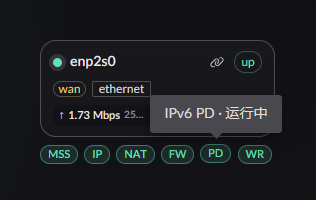
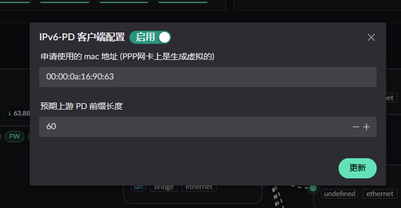
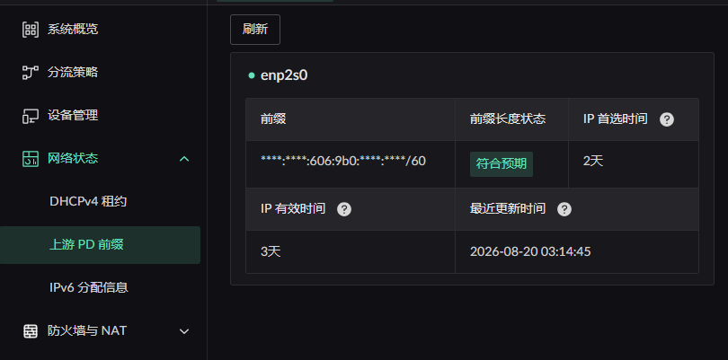

# IPv6 前缀获取

首先要确定你当前的运营商是否支持客户端进行前缀申请, 如您的运营商只支持 RA 通告 IPv6 地址, 则下方的所述的方式都不可用.

## 配置前缀获取

点击 WAN 区域网卡上的 PD 服务

将会弹出 PD 服务配置面板

:::info
**预期上游 PD 前缀长度** 不会影响获得上游前缀, 是作为前缀还未获得时, 作为 LAN 侧配置的一个**参考**.
:::

:::danger
**预期上游 PD 前缀长度** 不会影响获得上游前缀, 但是会影响 LAN 侧 IPv6 的分配配置.
:::

## 获得的前缀如何查看

点击左侧菜单的 **网络状态** -> **上游 PD 前缀** 中即可查看

:::info
当 **预期上游 PD 前缀长度** 与实际不符时, 可在此看到报错.
:::
